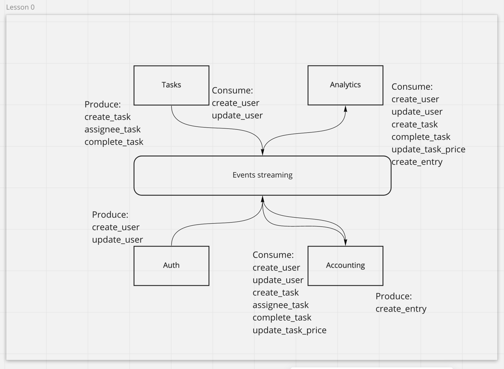

# Week 0 - Черновой проект системы

https://miro.com/app/board/o9J_lofiGi4=/?moveToWidget=3074457366692067091&cot=14

Что сделано:
1. Выбраны 4 микросервиса:
    * Tasks;
    * Auth;
    * Accounting;
    * Analytics.
    
2. Определен способ коммуникации меджу сервисами - шина данных Events Streaming (предположительно без синхронных коммуникаций).
3. Определен предположительный список event-ов. Какой сервис автор события, какой сервис потребитель события.

пые
