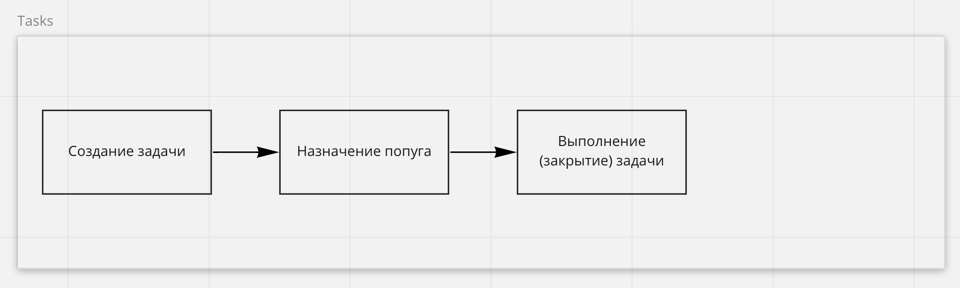
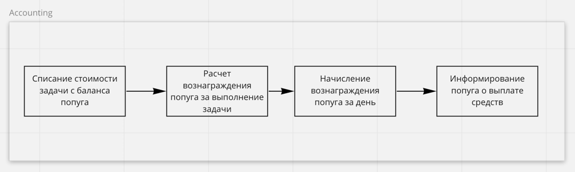
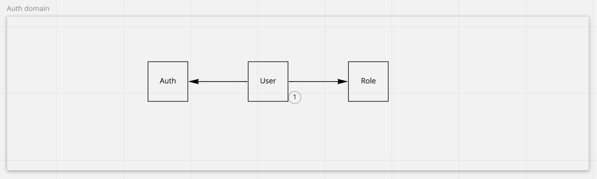
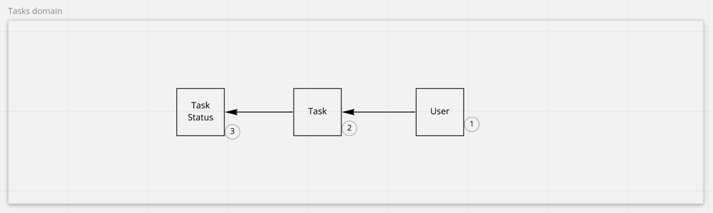
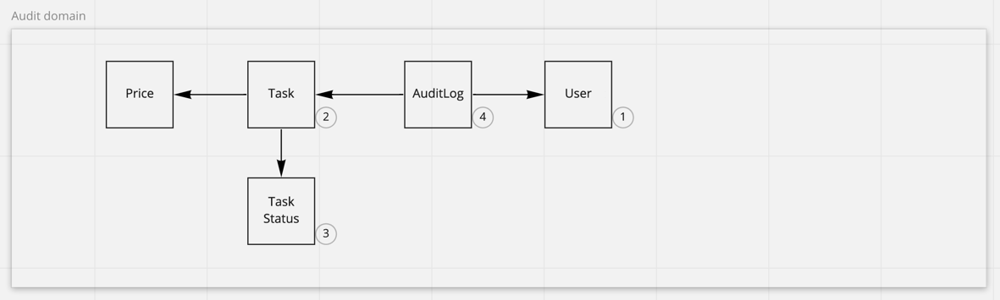
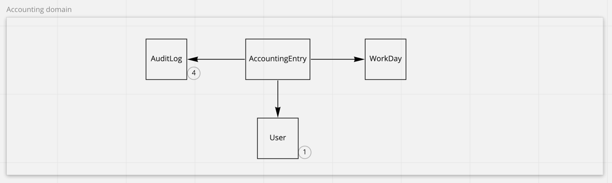
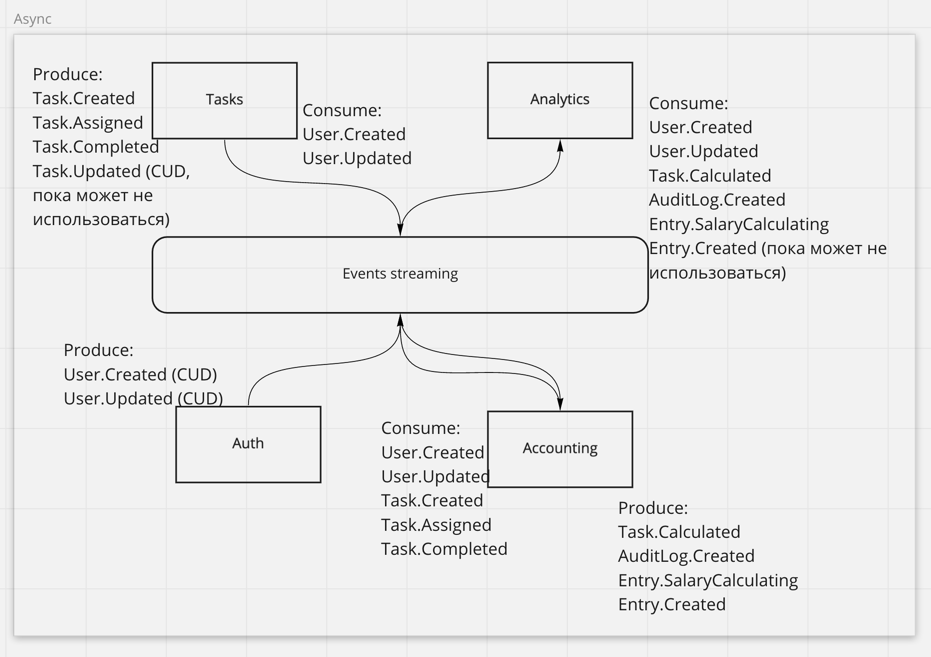

# Week 1 - Проектирование

https://miro.com/app/board/o9J_lofiGi4=/?moveToWidget=3074457366695286313&cot=14

### Разбор требований (актор, команда, событие, query)

#### 1. Task tracker

**Авторизация**
* Actor: User
* Command: Login to task tracker app
* Data: ???
* Event: User.Logined (not to use)

**Создание задачи**
* Actor: User
* Command: Create task
* Data: Task info (title + description)
* Event: Task.Created

**Распределение (assignee) задач**
* Actor: Privileged User (менеджер или руководитель)
* Command: Assignee tasks
* Data: Tasks, users
* Event: Task.Assigned

**Выполнение задачи**
* Actor: User
* Command: Complete tasks
* Data: Task, timestamp, user_id
* Event: Task.Completed

**Дашборд задач**
* Actor: User
* Query: Get all tasks
* Data: Tasks (status + assignee + title + description)

**Список заасайненных задач**
* Actor: User 
* Query: Get my assigned tasks
* Data: Tasks (status + assignee + title + description)

#### 2. Accounting

**Авторизация**
* Actor: User
* Command: Login to accounting app
* Data: ???
* Event: User.Logined (not to use)

**Расчет цены задачи**
* Actor: Event "Task.Created"
* Command: Calculate task price
* Data: task + calculator
* Event: Task.Calculated

**Списание денег с баланса пользователя**
* Actor: Event "Task.Assigned"
* Command: Debiting money from the user
* Data: user, task price
* Event: Debiting.Completed (not to use)

**Вознаграждение за выполнение задачи**
* Actor: Event "Task.Completed" или Event "Task.Assigned"
* Command: Reward for completing a task
* Data: task + calculator
* Event: AuditLog.Created

**Расчет ЗП за рабочий день**
* Actor: Cron scheduler
* Command: Calculate salary per working day
* Data: users tasks + tasks price
* Event: Entry.SalaryCalculating

**Информирование о ЗП за рабочий день**
* Actor: Event "SalaryCalculating.Completed"
* Command: Send info about salary calculating
* Data: entries, users
* Event: SalaryCalculating.Sent (not to use)

**Создание баланса на рабочий день (обнуление баланса)**
* Actor: Cron scheduler
* Command: Create users entries for day
* Data: users
* Event: Entry.Created

**Дашборд с информацией о балансе и доходе компании**
* Actor: Privileged User (администратор и бухгалтер)
* Query: Get company accounting info
* Data: users, audit logs, entries

**Дашборд c информацией о деятельности и балансе попуга**
* Actor: User (попуг)
* Query: Get user audit and accounting info
* Data: user audit logs, entries

#### 3. Analytics

**Авторизация**
* Actor: User
* Command: Login to analytics app
* Data: ???
* Event: User.Logined (not to use)

**Дашборд с информацией о доходе компании**
* Actor: Privileged User (администратор и бухгалтер)
* Query: Get revenue information
* Data: tasks, entries

**Дашборд с информацией о стоимости задач**

* Actor: Privileged User (администратор и бухгалтер)
* Query: Get task prices information
* Data: tasks, entries

### Бизнес цепочки

#### Tasks

#### Accounting

### Модель данных и модель доменов

#### Auth

#### Tasks

#### Audit

#### Accounting

### Сервисы и способы их коммуникации, CUD события
